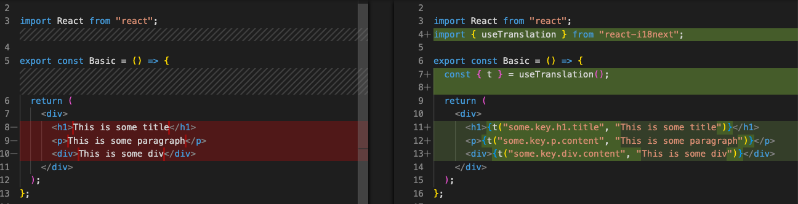

# Scaffolding React i18n examples

This repository contains examples on how to transform your React code to replace hard coded strings with translation functions. The setup can be seen as a starting point for building your own transformers to scaffold your `react-i18next` or `react-intl` internationalization.



The examples use [ts-morph](https://ts-morph.com/) but this can be replaced by either working directly with the [Typscript compiler API](https://github.com/microsoft/TypeScript/wiki/Using-the-Compiler-API) or using another AST parser.

There are more transformations than can be useful like automatically replacing any alt tags text with a translation function. The `transform` function can be extended to handle more automatic transformations.

## How to test

The `transformers` can be found in the [`src/transformers`](./src/transformers/) folder, and the tests in the [`tests`](./tests/) folder.

Install all required dependencies:

```bash
pnpm install
```

Then run all the tests:

```bash
pnpm test
```
